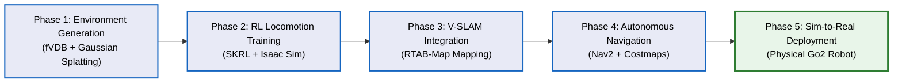
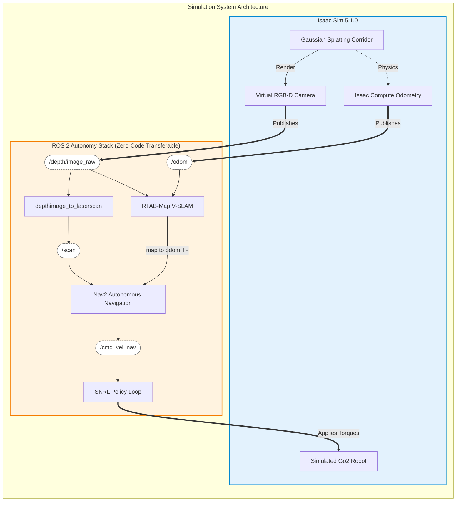

# Sim-to-Real Autonomous Navigation for Quadruped Robots

[](https://docs.isaacsim.omniverse.nvidia.com/latest/index.html)
[](https://docs.ros.org/en/jazzy/)
[]()

This repository contains the codebase for our capstone project and ICCAS paper submission, focusing on a **Zero-Code Sim-to-Real Architecture** for quadruped robots. 

By integrating Reinforcement Learning (RL) based locomotion with industry-standard ROS 2 autonomy stacks (RTAB-Map & Nav2), this project demonstrates how to train and validate a quadruped robot in a highly realistic virtual environment, and seamlessly deploy the exact same autonomy code to the physical hardware.

---

## 🌟 Key Features (The 3 Core Pillars)

1. **High-Fidelity Virtual Environment (fVDB + Gaussian Splatting)**
   - Utilizes advanced photorealistic rendering to minimize the visual reality gap.
   - Provides identical visual features for V-SLAM algorithms in both simulation and reality.

2. **Robust RL Locomotion (SKRL)**
   - The robot's base walking capabilities are governed by a robust Neural Network policy trained via Reinforcement Learning.
   - Includes a **Safety-Critical Velocity Override** system that prioritizes human keyboard input over autonomous commands to prevent collisions.

3. **Decoupled ROS 2 Autonomy Stack (RTAB-Map & Nav2)**
   - Converts RGB-D data into 2D laser scans via `depthimage_to_laserscan` for efficient, LiDAR-free 2D obstacle avoidance.
   - Implements a seamless **Virtual Sensor Bridge (OmniGraph & Static TF)** to resolve coordinate frame conflicts (`World` vs `map -> odom`).
   - The Nav2 stack calculates the path and publishes `/cmd_vel_nav`, which is directly translated into joint torques by the RL policy.

---

## 🏗️ System Architecture

### 1. Research Methodology Pipeline



### 2. Sim-to-Real Data Flow



👉 **[View Detailed Architecture Documentation & Real-World Diagram](./docs/architecture.md)**

---

## 🚀 Quick Start Guide

### Prerequisites
- **OS:** Ubuntu 24.04
- **Simulation:** NVIDIA Isaac Sim 5.1.0
- **ROS 2:** Jazzy Jalisco
- **Dependencies:** `nav2_bringup`, `rtabmap_ros`, `depthimage_to_laserscan`, `nav2_map_server`

### 1. Launch the Simulation (Isaac Sim + RL Policy)
This script launches Isaac Sim, loads the Gaussian Splatting environment, and runs the SKRL policy in inference mode. It also activates the OmniGraph ROS 2 bridge.

```bash
# Terminal 1
./play.sh
```

### 2. Mapping Mode (Optional: Create a New Map)
If you want to explore the environment and generate a new 3D/2D map using RTAB-Map before running autonomous navigation, use the mapping script:

```bash
# Terminal 2
source /opt/ros/jazzy/setup.bash
./rtabmap_mapping.sh
```
*   **How it works:** Drive the robot around using the keyboard (`W`, `A`, `S`, `D`, `Q`, `E`) within the Isaac Sim window. RTAB-Map will build the map (`~/.ros/rtabmap.db`) and save the 2D projection (`~/.ros/rtabmap.yaml` and `.pgm`).

### 3. Launch the Autonomy Stack (V-SLAM Localization + Nav2)
Once the robot is spawned in the simulation and you have a pre-built map, run the localization script. This will start the map server, depth-to-laser conversion, RTAB-Map localization, and the Nav2 behavior tree.

```bash
# Terminal 2
source /opt/ros/jazzy/setup.bash
./rtabmap_localization.sh
```

### 4. Command the Robot (RViz2)
The `rtabmap_localization.sh` script will automatically open RViz2.
1. Wait for the `[lifecycle_manager]: Managed nodes are active` message in the terminal.
2. In RViz2, click the **`2D Goal Pose`** button in the top toolbar.
3. Click and drag on the map to set a destination. The robot will automatically navigate to the target, avoiding dynamic obstacles dropped in the simulation.

---

## 🧠 Retraining the RL Policy

If the robot's locomotion behavior needs tuning (e.g., handling sharper turns, rougher terrain, or preventing falls), you can retrain the base policy using massively parallel environments.

### Running the Training
```bash
./train_go2.sh
```
*   **What this does:** This script launches the `skrl` training in headless mode (no UI) and spawns 4,096 parallel Go2 robots in the Isaac Sim environment. It maximizes GPU utilization to train the neural network rapidly.

### Applying the New Weights
After the training completes (or even while it's running), the new weights are saved in your `logs/` directory.

1.  Navigate to `logs/skrl/unitree_go2_flat/<DATE_TIME>_ppo_torch/checkpoints/`
2.  Find the `best_agent.pt` file (or a specific step checkpoint like `agent_1000.pt`).
3.  Open `play.sh` and update the `+checkpoint=` path to point to your newly generated `.pt` file:
    ```bash
    # Example inside play.sh
    ./isaaclab.sh -p scripts/reinforcement_learning/skrl/play.py --task Isaac-Velocity-Flat-Unitree-Go2-v0 --num_envs 1 +checkpoint="logs/skrl/unitree_go2_flat/YOUR_NEW_FOLDER/checkpoints/best_agent.pt"
    ```
4.  Run `./play.sh` again to see your newly trained brain in action!

---

## 👥 Contributors
- **Minseok** - Architecture Design & Sim-to-Real Strategy
- **Hayoung** - ROS 2 Integration & Simulation Operation
