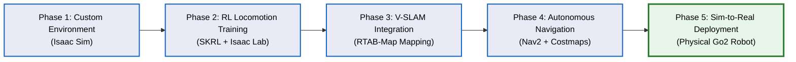
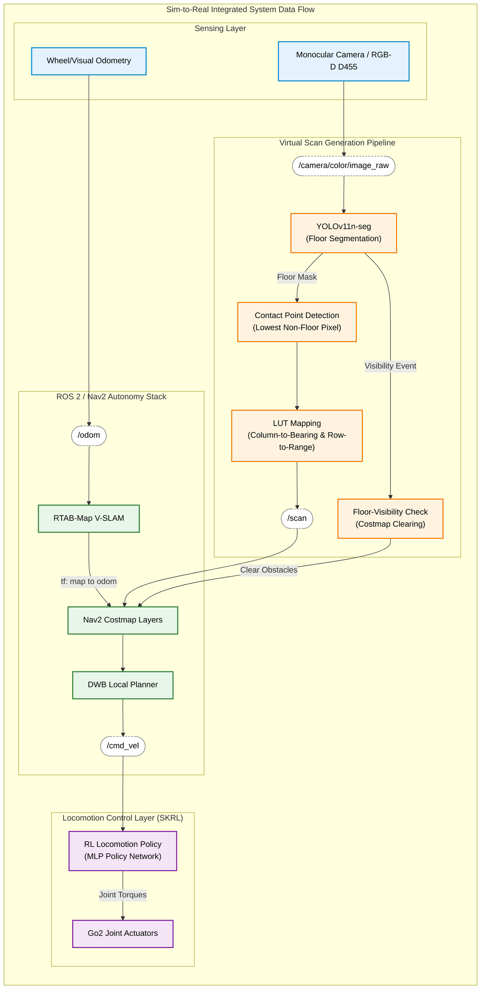

# Sim-to-Real Autonomous Navigation for Quadruped Robots

[](https://docs.isaacsim.omniverse.nvidia.com/latest/index.html)
[](https://isaac-sim.github.io/IsaacLab/)
[](https://docs.ros.org/en/jazzy/)
[]()

This repository is developed by the **CGV Lab** to research and establish a highly optimized **Zero-Code Sim-to-Real Architecture** for quadruped robots. It provides a complete workflow to train, test, and deploy autonomous navigation systems, bridging the gap between simulation and real-world deployment.

By integrating Reinforcement Learning (RL) based locomotion with industry-standard ROS 2 autonomy stacks (RTAB-Map & Nav2), this project demonstrates how to validate a quadruped robot in a highly realistic virtual environment, and seamlessly deploy the exact same autonomy code to the physical hardware.

---

## 🌟 Key Features

1. **Custom 3D Environment Support**
   - Built to support high-fidelity custom environments (e.g., imported meshes or Gaussian Splatting maps) to minimize the visual reality gap.
   - Provides identical visual features for V-SLAM algorithms in both simulation and reality.

2. **Robust RL Locomotion (SKRL)**
   - The robot's base walking capabilities are governed by a robust Neural Network policy trained via Reinforcement Learning.
   - Includes a **Safety-Critical Velocity Override** system that prioritizes human keyboard input over autonomous commands to prevent collisions.

3. **Decoupled ROS 2 Autonomy Stack (RTAB-Map & Nav2)**
   - Converts RGB-D data into 2D laser scans via `depthimage_to_laserscan` for efficient, LiDAR-free 2D obstacle avoidance.
   - Implements a seamless **Virtual Sensor Bridge (OmniGraph & Static TF)** to resolve coordinate frame conflicts (`World` vs `map -> odom`).
   - The Nav2 stack calculates the path and publishes `/cmd_vel_nav`, which is directly translated into joint torques by the RL policy.

---

## 🏗️ System Architecture

### 1. Research Methodology Pipeline


```mermaid
flowchart LR
    %% Styling
    classDef phase fill:#e8eaf6,stroke:#1565c0,stroke-width:2px,color:#000;
    classDef deploy fill:#e8f5e9,stroke:#2e7d32,stroke-width:3px,color:#000;

    P1["Phase 1: Custom Environment<br>(Isaac Sim)"]:::phase
    P2["Phase 2: RL Locomotion Training<br>(SKRL + Isaac Lab)"]:::phase
    P3["Phase 3: V-SLAM Integration<br>(RTAB-Map Mapping)"]:::phase
    P4["Phase 4: Autonomous Navigation<br>(Nav2 + Costmaps)"]:::phase
    P5["Phase 5: Sim-to-Real Deployment<br>(Physical Go2 Robot)"]:::deploy

    P1 --> P2
    P2 --> P3
    P3 --> P4
    P4 --> P5
```

### 2. Sim-to-Real Data Flow


```mermaid
flowchart TD
    %% Styling
    classDef sensing fill:#e3f2fd,stroke:#0288d1,stroke-width:2px,color:#000;
    classDef vscan fill:#fff3e0,stroke:#f57c00,stroke-width:2px,color:#000;
    classDef nav2 fill:#e8f5e9,stroke:#2e7d32,stroke-width:2px,color:#000;
    classDef locomotion fill:#f3e5f5,stroke:#7b1fa2,stroke-width:2px,color:#000;
    classDef topic fill:#ffffff,stroke:#757575,stroke-width:1px,stroke-dasharray: 3 3,color:#000;

    subgraph System_Data_Flow ["Sim-to-Real Integrated System Data Flow"]
        direction TB

        %% 1. Sensing Layer
        subgraph Sensing_Layer ["Sensing Layer"]
            Cam[Monocular Camera / RGB-D D455]:::sensing
            Odom[Wheel/Visual Odometry]:::sensing
        end

        %% 2. Virtual Scan Generation Pipeline (from ICCAS 0531)
        subgraph Virtual_Scan_Pipeline ["Virtual Scan Generation Pipeline"]
            YOLO["YOLOv11n-seg<br>(Floor Segmentation)"]:::vscan
            Contact["Contact Point Detection<br>(Lowest Non-Floor Pixel)"]:::vscan
            LUT["LUT Mapping<br>(Column-to-Bearing & Row-to-Range)"]:::vscan
            Clearing["Floor-Visibility Check<br>(Costmap Clearing)"]:::vscan
            
            RGB_Topic([/camera/color/image_raw]):::topic
            Scan_Topic([/scan]):::topic
            
            Cam --> RGB_Topic
            RGB_Topic --> YOLO
            YOLO -->|Floor Mask| Contact
            YOLO -->|Visibility Event| Clearing
            Contact --> LUT --> Scan_Topic
        end

        %% 3. Autonomy Navigation Stack (Nav2)
        subgraph Autonomy_Stack ["ROS 2 / Nav2 Autonomy Stack"]
            RTABMap[RTAB-Map V-SLAM]:::nav2
            Costmap[Nav2 Costmap Layers]:::nav2
            Planner[DWB Local Planner]:::nav2
            
            Odom_Topic([/odom]):::topic
            CmdVel_Topic([/cmd_vel]):::topic
            
            Odom --> Odom_Topic
            Odom_Topic --> RTABMap
            RTABMap -->|tf: map to odom| Costmap
            Scan_Topic --> Costmap
            Clearing -->|Clear Obstacles| Costmap
            Costmap --> Planner --> CmdVel_Topic
        end

        %% 4. Locomotion Control Layer
        subgraph Locomotion_Layer ["Locomotion Control Layer (SKRL)"]
            RL_Policy["RL Locomotion Policy<br>(MLP Policy Network)"]:::locomotion
            Motor[Go2 Joint Actuators]:::locomotion
            
            CmdVel_Topic --> RL_Policy
            RL_Policy -->|Joint Torques| Motor
        end
    end
```

👉 **[View Detailed Architecture Documentation & Real-World Diagram](./docs/architecture.md)**

---

## 🚀 Execution Scripts Guide

This repository contains customized bash scripts to easily launch different phases of the Sim-to-Real pipeline.

### Prerequisites
- **OS:** Ubuntu 24.04
- **Simulation:** NVIDIA Isaac Sim 5.1.0 & Isaac Lab
- **ROS 2:** Jazzy Jalisco
- **Dependencies:** `nav2_bringup`, `rtabmap_ros`, `depthimage_to_laserscan`, `nav2_map_server`

### 1. `play.sh` (Simulation + RL Policy)
This script launches Isaac Sim, loads the environment, and runs the pre-trained SKRL policy in inference mode. It also automatically activates the OmniGraph ROS 2 bridge to publish sensor data.

```bash
# Terminal 1
./play.sh
```

### 2. `rtabmap_mapping.sh` (Map Creation Mode)
Use this script to explore a new environment and generate a 3D/2D map using RTAB-Map before running autonomous navigation.

```bash
# Terminal 2
source /opt/ros/jazzy/setup.bash
./rtabmap_mapping.sh
```
*   **How it works:** Drive the robot around using the keyboard (`W`, `A`, `S`, `D`, `Q`, `E`) within the Isaac Sim window. RTAB-Map will build the 3D database (`~/.ros/rtabmap.db`).

⚠️ **CRITICAL: Saving the 2D Map for Nav2**
Before you stop the mapping script, you **MUST** save the 2D grid map so Nav2 can use it. Open a new terminal and run:
```bash
# Terminal 3 (While Terminal 2 is still running)
source /opt/ros/jazzy/setup.bash
ros2 run nav2_map_server map_saver_cli -f ~/.ros/rtabmap
```
This will generate `~/.ros/rtabmap.yaml` and `~/.ros/rtabmap.pgm`. You can now safely `Ctrl+C` the mapping script.

### 3. `rtabmap_localization.sh` (Autonomy Stack: V-SLAM + Nav2)
Once the robot is spawned in the simulation and you have a pre-built map, run this script to launch the full autonomy stack. It starts the map server, depth-to-laser conversion, RTAB-Map localization, and the Nav2 behavior tree.

```bash
# Terminal 2
source /opt/ros/jazzy/setup.bash
./rtabmap_localization.sh
```

### 4. Command the Robot (RViz2)
The `rtabmap_localization.sh` script will automatically open RViz2.
1. Wait for the `[lifecycle_manager]: Managed nodes are active` message in the terminal.
2. In RViz2, click the **`2D Goal Pose`** button in the top toolbar.
3. Click and drag on the map to set a destination. The robot will automatically navigate to the target, utilizing the RL policy for locomotion and Nav2 for obstacle avoidance.

---

## 🧠 `train_go2.sh` (Retraining the RL Policy)

If the robot's locomotion behavior needs tuning (e.g., handling sharper turns, rougher terrain, or preventing falls), you can retrain the base policy using massively parallel environments.

### Running the Training
```bash
./train_go2.sh
```
*   **What this does:** This script launches the `skrl` training in headless mode (no UI) and spawns 4,096 parallel Go2 robots in the Isaac Sim environment. It maximizes GPU utilization to train the neural network rapidly.

### Applying the New Weights
After the training completes, the new weights are saved in the `logs/` directory.

1.  Navigate to `logs/skrl/unitree_go2_flat/<DATE_TIME>_ppo_torch/checkpoints/`
2.  Find the `best_agent.pt` file.
3.  Open `play.sh` and update the `+checkpoint=` path to point to your newly generated `.pt` file:
    ```bash
    # Example inside play.sh
    ./isaaclab.sh -p scripts/reinforcement_learning/skrl/play.py --task Isaac-Velocity-Flat-Unitree-Go2-v0 --num_envs 1 +checkpoint="logs/skrl/unitree_go2_flat/YOUR_NEW_FOLDER/checkpoints/best_agent.pt"
    ```
4.  Run `./play.sh` again to see your newly trained agent in action!

---

## 📝 ICCAS 2026 Paper Draft

This branch (`paper`) contains the LaTeX draft and templates for the ICCAS 2026 submission.

*   **Manuscript Directory:** [ICCAS](./ICCAS)
*   **Main LaTeX Source:** [ICCAS/main.tex](./ICCAS/main.tex) (compiled to match `ICCAS.cls`)
*   **Official Class Template:** [ICCAS/Paper-Template_ICCAS.tex](./ICCAS/Paper-Template_ICCAS.tex)
*   **Compiled PDF Draft:** [ICCAS/main.pdf](./ICCAS/main.pdf)

To collaborate on this paper, edit the LaTeX source in the [ICCAS](./ICCAS) directory and compile with `pdflatex`.
