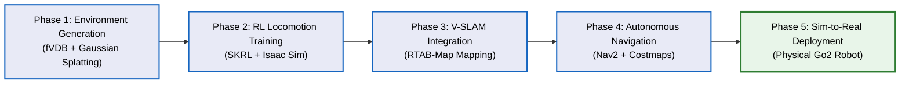

# Sim-to-Real Architecture for Quadruped Robots

This document details the framework for our ICCAS paper. It is divided into two main sections: the **Chronological Research Methodology** (how we built it step-by-step) and the **System Data Flow Architecture** (how the code runs in real-time).

## 1. Research Methodology Pipeline (Chronological Steps)

This flowchart illustrates the 5-step process we followed to achieve Sim-to-Real autonomous navigation.

---

## 2. Real-Time System Data Flow (Sim-to-Real Architecture)

The diagram below illustrates the exact input/output (I/O) data flow *when the robot is running autonomously*. The solid lines represent the Simulation pipeline (currently active), while the dashed lines represent the future Real-World pipeline, which will plug into the exact same core stack.

```mermaid
flowchart LR
    %% Styling
    classDef sim fill:#e3f2fd,stroke:#0288d1,stroke-width:2px;
    classDef real fill:#f1f8e9,stroke:#388e3c,stroke-width:2px,stroke-dasharray: 5 5;
    classDef core fill:#fff8e1,stroke:#f57c00,stroke-width:2px;
    classDef topic fill:#ffffff,stroke:#757575,stroke-width:1px;

    %% ----------------------------------------------------
    %% LEFT: SIMULATION REALM
    %% ----------------------------------------------------
    subgraph Sim_Realm [Simulation Realm Isaac Sim]
        direction TB
        SimEnv[Gaussian Splatting Env]
        SimCam[Virtual Camera]
        SimOdom[Isaac Odometry]
        
        SimEnv -->|Render| SimCam
        SimEnv -->|Physics| SimOdom
    end
    class Sim_Realm sim;

    %% ----------------------------------------------------
    %% MIDDLE: SHARED CORE STACK (Zero-Code Transfer)
    %% ----------------------------------------------------
    subgraph Shared_Core [Shared Autonomy Stack ROS 2 & SKRL]
        direction TB
        
        %% Pillar 1: Perception
        subgraph Perception [1. Perception]
            Depth_Topic([/depth/image_raw]) --> |depthimage_to_laserscan| Scan_Topic([/scan])
        end
        
        %% Pillar 2: SLAM & Navigation
        subgraph Navigation [2. RTAB-Map & Nav2]
            RGB_Topic([/rgb/image_raw])
            Odom_Topic([/odom])
            
            RGB_Topic & Depth_Topic & Odom_Topic --> |RTAB-Map| Map_Topic([/map & map->odom TF])
            Map_Topic & Scan_Topic --> |Costmap & Planner| Nav2[Nav2 Controller]
            Nav2 --> |geometry_msgs/Twist| Cmd_Vel([/cmd_vel_nav])
        end

        %% Pillar 3: Locomotion
        subgraph Locomotion [3. RL Locomotion]
            Cmd_Vel --> Override{Safety Override}
            Keyboard([Keyboard I/O]) --> Override
            Override --> |final_cmd_vel| Policy[SKRL Policy best_agent.pt]
            Policy --> |Action Tensor| Torques([Joint Torques])
        end
    end
    class Shared_Core,Perception,Navigation,Locomotion core;
    class Depth_Topic,Scan_Topic,RGB_Topic,Odom_Topic,Map_Topic,Cmd_Vel,Keyboard,Torques topic;

    %% ----------------------------------------------------
    %% RIGHT: REAL-WORLD REALM
    %% ----------------------------------------------------
    subgraph Real_Realm [Real-World Realm Hardware]
        direction TB
        RealEnv[Physical Corridor]
        RealCam[Realsense D435i]
        RealOdom[Unitree Go2 Hardware Odom]
        
        RealEnv -.->|Optical| RealCam
        RealEnv -.->|IMU/Kinematics| RealOdom
    end
    class Real_Realm real;

    %% ----------------------------------------------------
    %% CONNECTIONS (Input / Output mapping)
    %% ----------------------------------------------------
    
    %% Sim Inputs to Core
    SimCam ==>|RGB-D Data| Depth_Topic
    SimCam ==>|RGB-D Data| RGB_Topic
    SimOdom ==>|Odometry Data| Odom_Topic
    
    %% Real Inputs to Core (Future)
    RealCam -.->|RGB-D Data| Depth_Topic
    RealCam -.->|RGB-D Data| RGB_Topic
    RealOdom -.->|Odometry Data| Odom_Topic

    %% Core Outputs to Physical Bodies
    Torques ==>|Apply Force| SimRobot[Simulated Go2]
    Torques -.->|Apply Force| RealRobot[Physical Go2]

```

---

## 2. Visual Architecture (Image Placeholders)

*Note: Replace the image paths below once the actual photos are uploaded to the `docs/images/` folder.*

### Left Axis: Simulation Environment

  <!-- TODO: Upload gaussian_sim.png to docs/images/ -->
  
  
<i>Figure 1: Unitree Go2 navigating a Gaussian Splatting map in Isaac Sim.</i>

### Center Axis: The Core Stack

  <!-- TODO: Upload rviz_nav.png to docs/images/ -->
  
  
<i>Figure 2: Real-time 2D Costmap generation and path planning via RTAB-Map and Nav2.</i>

### Right Axis: Real-World Deployment

  <!-- TODO: Upload real_go2.jpg to docs/images/ -->
  
  
<i>Figure 3: The physical Unitree Go2 robot equipped with an Intel Realsense D435i camera.</i>

---

## 3. Data Flow Highlights for ICCAS

1. **Input Harmonization (Perception):** 
   Whether the input comes from the virtual Isaac Sim camera or the real Realsense D435i, the data strictly conforms to `sensor_msgs/Image`. The `depthimage_to_laserscan` node acts as an equalizer, converting 3D depth into a standard 2D `/scan` topic, bridging the gap for the 2D Nav2 Costmap.

2. **Decoupled Autonomy (Navigation):** 
   The SLAM and Navigation modules (RTAB-Map and Nav2) are completely agnostic to the robot's physical embodiment. They consume standard `/odom` and `/scan` topics and output a highly reliable `/cmd_vel_nav` (`geometry_msgs/Twist`), proving the zero-code transferability of the stack.

3. **RL Translation Layer (Locomotion):** 
   The final `/cmd_vel_nav` is passed into the RL Policy execution loop. Here, the target velocities are translated into 12-DoF joint torques via the SKRL neural network. A critical safety override is placed just before the network input, allowing human intervention regardless of the autonomy stack's commands.