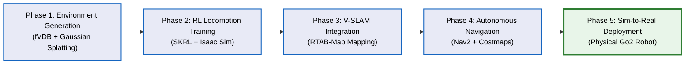
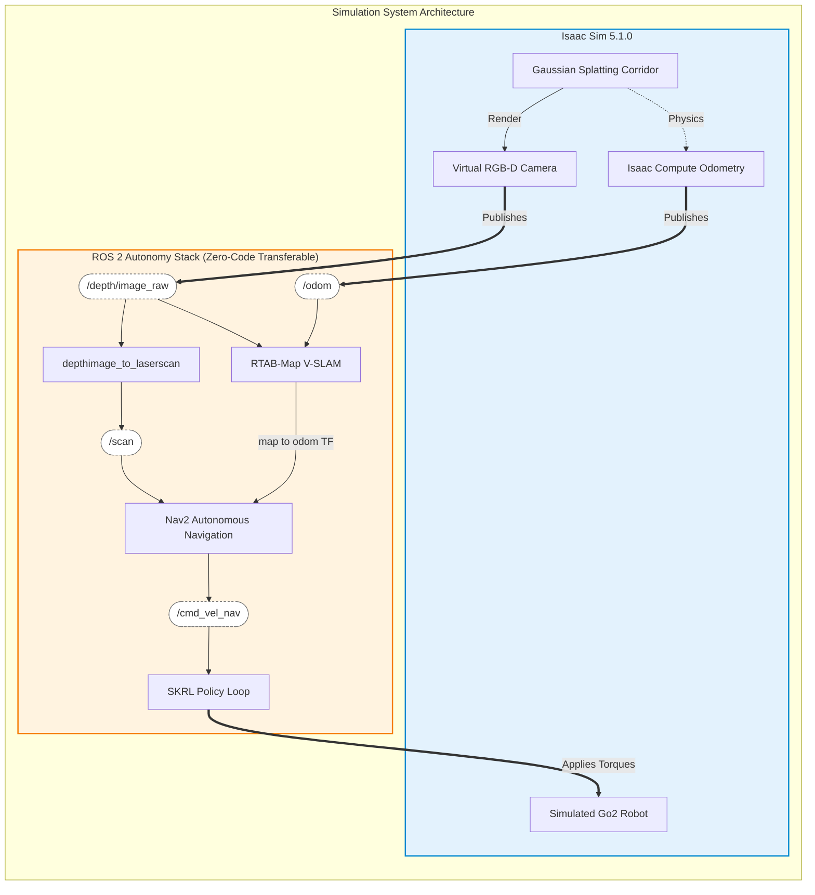
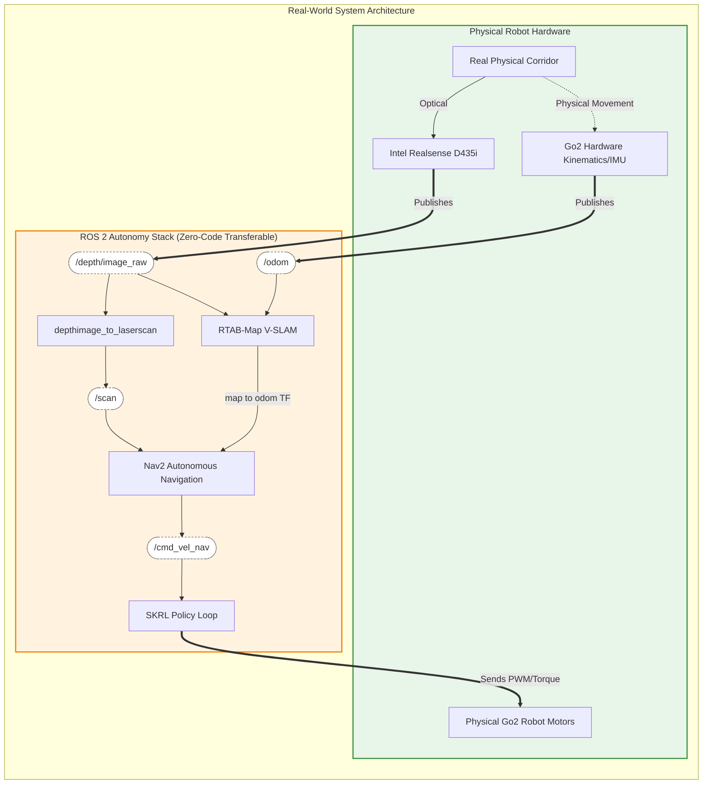

# Sim-to-Real Architecture for Quadruped Robots

This document details the framework for our ICCAS paper. It is divided into the **Chronological Research Methodology** and the **Separated System Architectures** (Simulation vs. Real-World).

## 1. Research Methodology Pipeline (Chronological Steps)

This flowchart illustrates the 5-step process we followed to achieve Sim-to-Real autonomous navigation.

---

## 2. System Architecture: Simulation Realm

This diagram shows the complete data flow entirely within the Isaac Sim environment. The ROS 2 autonomy stack runs flawlessly inside the simulation using the OmniGraph sensor bridge.

---

## 3. System Architecture: Real-World Deployment

This diagram shows the architecture deployed on the physical robot. Notice that the **ROS 2 Autonomy Stack** remains exactly the same as in the Simulation phase. Only the hardware inputs and outputs change.

---

## 4. Key Takeaways for the Paper

By presenting these two diagrams side-by-side in your paper, you can effectively demonstrate the **"Seamless Sim-to-Real Transfer"**. 

Reviewers will clearly see that the orange box (`ROS 2 Autonomy Stack`) is perfectly identical in both Figure 2 (Simulation) and Figure 3 (Real-World). The only elements that change are the blue box (Virtual Sensors) swapping out for the green box (Physical Sensors). This proves the robustness and high fidelity of your Isaac Sim Gaussian environment setup.