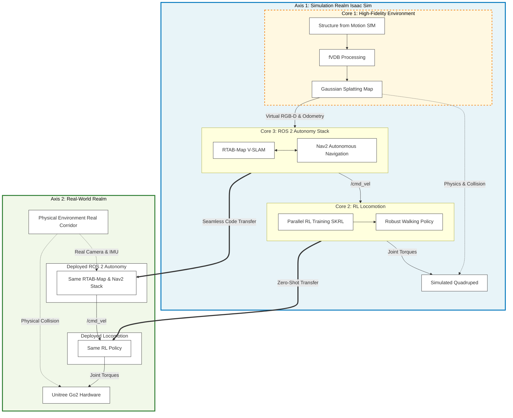

# Sim-to-Real Architecture for Quadruped Robots

This document outlines the conceptual framework for our ICCAS paper. It highlights the seamless Sim-to-Real transfer of autonomous navigation for a quadruped robot (Unitree Go2) using NVIDIA Isaac Sim and ROS 2.

## Concept Diagram: Bridging Simulation and Reality

The architecture is divided into two primary axes: the **Simulation Realm** and the **Real-World Realm**. The simulation environment acts as a robust proving ground, built upon three core pillars, which are then seamlessly transferred to the physical robot.

## The 3 Core Pillars of the Simulation (For Paper Narrative)

To maximize the paper's impact at ICCAS, the narrative should focus on how these three distinct technologies were integrated to bridge the Sim-to-Real gap without performance degradation.

### 1. High-Fidelity Environment via Gaussian Splatting (fVDB + SfM)
Traditional mesh-based simulations often fail to capture complex lighting, textures, and thin structures, leading to the "reality gap" in visual SLAM. By utilizing **Structure from Motion (SfM)** and processing the point clouds via **fVDB**, we generated highly optimized **Gaussian Splatting** maps. This provided the simulated RGB-D cameras with photorealistic data, allowing the RTAB-Map algorithm to extract visual features identical to what it would see in the real world.

### 2. Robust RL Locomotion Policy
Instead of relying on fragile analytical kinematics, the robot's base movement is governed by a Neural Network trained via Reinforcement Learning (RL) in Isaac Sim. The policy was trained across massively parallel environments to handle diverse terrains and velocity commands, ensuring that when the Nav2 stack commands a sudden turn or acceleration, the robot maintains stability.

### 3. Seamless ROS 2 Autonomy Integration (RTAB-Map + Nav2)
The autonomy stack was built using industry-standard ROS 2 frameworks. A critical contribution is the **Virtual Sensor Bridge architecture** (OmniGraph & Static TF patching). This bridge translates the absolute ground truth of the simulation (`World`) into the continuous, standard coordinate frames required by ROS 2 (`map -> odom -> base_link`). Consequently, the exact same Docker container running RTAB-Map and Nav2 can be unplugged from the simulation and plugged into the physical robot without rewriting a single line of autonomy code.